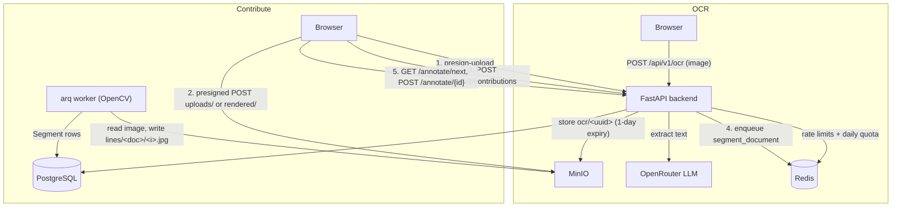

# NepaliOCR

Devanagari/Nepali OCR web app. It runs OCR through an LLM (via OpenRouter) today and collects line-level training data for an own OCR model later.

## Features

- **OCR tool** (`/upload`): upload an image, get Nepali text back. The engine sits behind an abstraction (`OCRRouter`, ordered by `ENGINE_ORDER`) so it can be swapped.
- **Auth tiers**: registered users get 25 OCR requests/day; anonymous users get 10/day per IP. On top of that, a per-minute rate limit (10/min) applies.
- **Private OCR uploads**: images sent to the OCR tool are stored under `ocr/`, never used as training data, and deleted after 1 day by a MinIO lifecycle rule.
- **Contribute** (`/contribute`), two tabs:
  - **Data Collection**: upload a handwritten page, or generate random Nepali sentences (1–20 lines) from the bundled dictionary and render them. The image is uploaded straight to MinIO (presigned POST) and registered as a contribution. A background `arq` worker then splits it into line images with OpenCV.
  - **Annotation**: get a random un-annotated line image, transcribe it with the built-in Devanagari keyboard, and submit. Signing in is required to submit.
- **Local OCR history**: the browser keeps the last 20 runs (thumbnail + text), with re-run/download/delete.
- **Result details**: usage badge, char/word/line/byte counts, engine badge, `.txt` download.

## Architecture



## Tech Stack

| Layer | Choice |
|---|---|
| Backend | FastAPI (Python 3.12, uvicorn) |
| OCR engine | OpenRouter, model set by `OPENROUTER_MODEL` (multiple keys rotated via `OPENROUTER_API_KEYS`) |
| Database | PostgreSQL 16 (SQLAlchemy async + asyncpg, Alembic migrations) |
| Cache / queue | Redis 7 (rate limits, daily quotas, `arq` job queue) |
| Worker | `arq` + `opencv-python-headless` (line segmentation) |
| Object storage | MinIO (self-hosted, presigned URLs) |
| Auth | JWT (HS256, 15 min TTL) + bcrypt |
| Frontend | Vite + React 19 + TanStack Router + TanStack Query |
| Styling | Tailwind CSS + shadcn/ui + framer-motion |
| Deployment | Docker Compose on a VPS behind Traefik (Let's Encrypt) |

## Project Layout

```
backend/        FastAPI app (app/), Alembic migrations, tests, scripts
frontend/       Vite + React app (src/routes, src/components, src/features, src/lib)
deployments/
  local-dev/    compose.yml + Dockerfiles for local development
  production/   compose.yml, Dockerfiles, nginx.conf, deploy/setup scripts
.github/        CI deploy workflow
```

## Quick Start (Docker)

```bash
cp deployments/local-dev/.env.example deployments/local-dev/.env
# Edit .env and set at least:
#   OPENROUTER_API_KEYS='["sk-or-v1-..."]'
#   JWT_SECRET="some-random-secret"

make build   # docker compose -f deployments/local-dev/compose.yml build
make up      # postgres, redis, minio, backend, worker, frontend
make logs    # follow logs
```

| Service | URL |
|---|---|
| Frontend | http://localhost:3000 |
| Backend API | http://localhost:8000 (`/docs` for OpenAPI) |
| Health | http://localhost:8000/api/health |
| MinIO console | http://localhost:9001 (`minioadmin` / `minioadmin`) |

Other make targets: `down`, `psql`, `backend-shell`, `frontend-shell`.

MinIO settings in `deployments/local-dev/.env`:
- `MINIO_ROOT_USER` / `MINIO_ROOT_PASSWORD`: root credentials (default `minioadmin`)
- `MINIO_PUBLIC_ENDPOINT=localhost:9000`: the host the browser can reach, used in presigned URLs (the container-internal `minio:9000` is not reachable from the browser)

### Running without Docker

You still need Postgres, Redis and MinIO running (e.g. `docker compose -f deployments/local-dev/compose.yml up postgres redis minio`).

```bash
# Backend
cd backend
cp .env.example .env            # fill in OPENROUTER_API_KEYS, JWT_SECRET
pip install -r requirements.txt
alembic upgrade head
uvicorn app.main:app --reload --port 8000
python -m arq app.jobs.WorkerSettings   # worker, in a second shell
pytest                                  # tests

# Frontend
cd frontend
npm install
npm run dev                     # http://localhost:3000
```

## Configuration

All settings are environment variables (`backend/app/core/config.py`). The main ones:

| Variable | Default | Purpose |
|---|---|---|
| `OPENROUTER_API_KEYS` | `[]` | JSON list (or a single string) of OpenRouter keys |
| `OPENROUTER_MODEL` | `google/gemini-2.0-flash-exp:free` | Model used for OCR |
| `ENGINE_ORDER` | `openrouter` | Comma-separated engine fallback order |
| `JWT_SECRET` | `change-me-in-production` | JWT signing key |
| `RATE_LIMIT_PER_MINUTE` | `10` | Per-IP/minute limit on API routes |
| `DAILY_LIMIT_AUTHENTICATED` / `DAILY_LIMIT_ANONYMOUS` | `25` / `10` | Daily OCR quota |
| `MAX_IMAGE_SIZE` | `10485760` | Max upload size in bytes (JPEG/PNG only) |
| `DB_*`, `REDIS_URL` | localhost | Postgres / Redis connection |
| `MINIO_ENDPOINT`, `MINIO_ACCESS_KEY`, `MINIO_SECRET_KEY`, `MINIO_BUCKET` | `minio:9000`, `minioadmin`, `nepali-ocr` | Object storage |
| `MINIO_PUBLIC_ENDPOINT`, `MINIO_PUBLIC_SECURE` | unset | Host used when signing presigned URLs for the browser |
| `ENVIRONMENT` | `development` | `production` refuses to start with default secrets |

## API

| Method | Path | Description | Auth |
|---|---|---|---|
| `POST` | `/api/v1/auth/register` | Create account (email + password) | None |
| `POST` | `/api/v1/auth/login` | Get JWT token | None |
| `POST` | `/api/v1/ocr` | Extract text from an `image` file **or** an `image_key` (`ocr/`, `uploads/`, `rendered/`). Form field `purpose` (`ocr` / `sample`), query `?engine=` | Optional (higher quota if authed) |
| `GET` | `/api/v1/usage` | Daily quota usage (`limit`, `used`, `remaining`) | Optional |
| `POST` | `/api/v1/storage/presign-upload` | Presigned POST policy (`key`, `url`, `fields`) for `section` `uploads` or `rendered`; MinIO enforces size and type | Optional |
| `POST` | `/api/v1/storage/presign-get` | Presigned GET URL for an object key (not for `ocr/` images) | Optional |
| `POST` | `/api/v1/contributions` | Register an uploaded image (`image_key`, `source`: `handwritten`/`ai`, `expected_lines`) and queue segmentation → `202` | Optional |
| `GET` | `/api/v1/contributions` | List contributions | Optional |
| `GET` | `/api/v1/contributions/{id}` | Contribution status + segments | Optional |
| `GET` | `/api/v1/contributions/{id}/segments` | Line segments with presigned image URLs | Optional |
| `GET` | `/api/v1/annotate/next` | Random un-annotated line: `{available, reason, total, done, remaining, next}`. `?exclude=id1,id2` skips ids | Optional |
| `POST` | `/api/v1/annotate/{segment_id}` | Submit `text` for a line (`409` if already annotated) | **Required** |
| `POST` | `/api/v1/annotate` | Legacy: register a standalone sample | **Required** |
| `GET` | `/api/health` | Health of DB, Redis and engines (503 if DB/Redis down) | None |
| `GET` | `/api/healthz` | Liveness (always 200) | None |

### OCR request

```bash
# File upload (the backend stores it under ocr/)
curl -X POST http://localhost:8000/api/v1/ocr -F "image=@document.jpg"

# Existing object key
curl -X POST http://localhost:8000/api/v1/ocr -F "image_key=rendered/<uuid>.png"

# purpose=sample stores the upload under rendered/ instead of ocr/
curl -X POST http://localhost:8000/api/v1/ocr -F "image=@test.png" -F "purpose=sample"

# Authenticated
curl -X POST http://localhost:8000/api/v1/ocr \
  -H "Authorization: Bearer <token>" -F "image=@document.jpg"
```

### OCR response

```json
{
  "text": "नमस्ते, यो एउटा नेपाली पाठ हो।",
  "confidence": null,
  "engine": "openrouter (google/gemini-2.0-flash-exp:free)",
  "metadata": {
    "filename": "document.jpg",
    "content_type": "image/jpeg",
    "size": 204856,
    "processing_time_ms": 1234,
    "request_id": "1712345678-1",
    "daily_remaining": 9,
    "image_key": "ocr/6cfe7278924a4a209a1fdec7fab50439.jpg"
  }
}
```

The endpoint returns `429` (with `Retry-After`) when engine capacity runs out, and `503` when every engine fails. A failed request does not use up quota.

## Storage Layout

Everything is in one bucket (`nepali-ocr` by default):

| Prefix | Contents |
|---|---|
| `ocr/` | OCR tool uploads; deleted after 1 day by a lifecycle rule; never used for training |
| `uploads/` | Handwritten contribution images |
| `rendered/` | AI-rendered sentence images |
| `lines/<document_id>/<i>.jpg` | Line crops from the segmentation worker (annotation queue) |

## Database Migrations

Alembic manages the schema (`backend/alembic/`). Both backend Dockerfiles run `alembic upgrade head` before starting the API. To add a migration: `cd backend && alembic revision -m "describe change"`.

## Production

`deployments/production/compose.yml` runs the stack behind Traefik, and `.github/workflows/deploy.yml` deploys it. Secrets come from Infisical. See `deployments/production/.env.example`.

- `MINIO_ROOT_USER` / `MINIO_ROOT_PASSWORD`: MinIO credentials (must not be `minioadmin`; the backend won't start with them in production).
- `MINIO_DOMAIN` → S3 API host. The backend and worker use it as `MINIO_PUBLIC_ENDPOINT`, so presigned URLs point at it.
- `MINIO_CONSOLE_DOMAIN` → console UI (port 9001).

Traefik `Host(...)` rules and `MINIO_PUBLIC_ENDPOINT` must use the same hosts, or presigned signatures won't match. Contribution uploads go from the browser straight to `MINIO_DOMAIN`. MinIO accepts cross-origin requests by default, so the bucket needs no extra CORS config.

## Security

- Secrets come only from the environment. With `ENVIRONMENT=production`, the backend refuses to start if `JWT_SECRET` is the default or under 32 chars, or if MinIO uses `minioadmin`.
- CORS is limited to an explicit allowlist (`BACKEND_CORS_ORIGINS` + `FRONTEND_URL`).
- OpenRouter keys stay on the backend and never reach the frontend.
- Passwords are hashed with bcrypt; JWTs have a short TTL (15 min).
- Rate limit (10/min/IP) plus a daily quota per user/IP.
- OCR uploads expire after 1 day and are kept out of the training dataset.

## Roadmap

- **Phase 1** (current): LLM OCR via OpenRouter, auth + quota, data collection and annotation
- **Phase 2**: PaddleOCR baseline (`?engine=paddleocr`; provider stub in `backend/app/services/ocr/paddleocr_provider.py`)
- **Phase 3**: Fine-tune PaddleOCR on synthetic + annotated Nepali data
- **Phase 4**: PaddleOCR as primary engine, OpenRouter as fallback

## License

Apache License 2.0. See [LICENSE](LICENSE).
